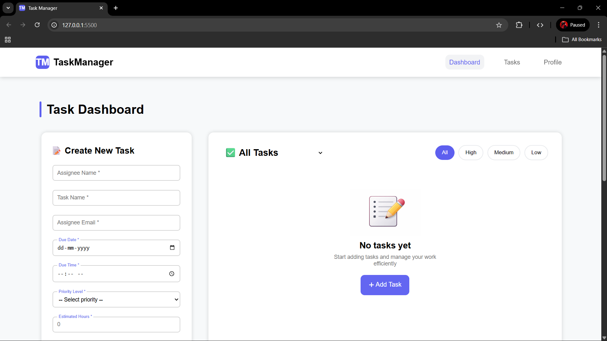
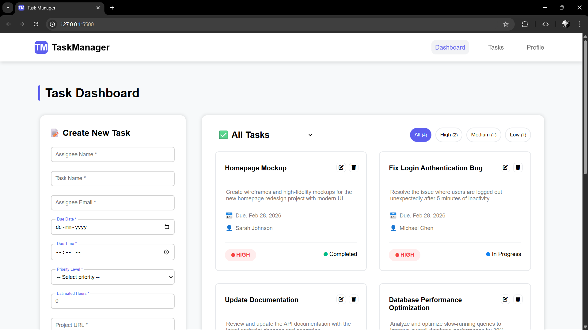
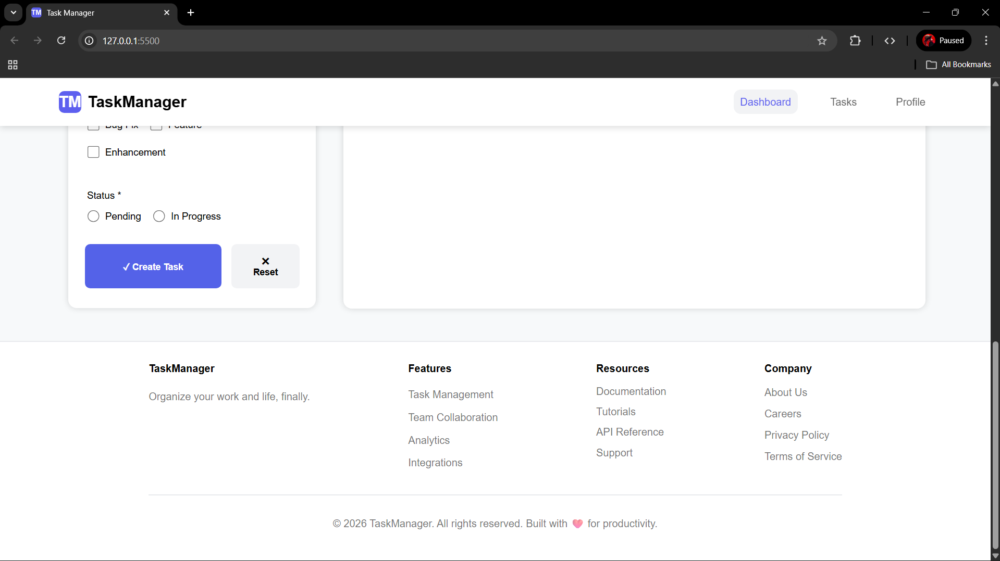
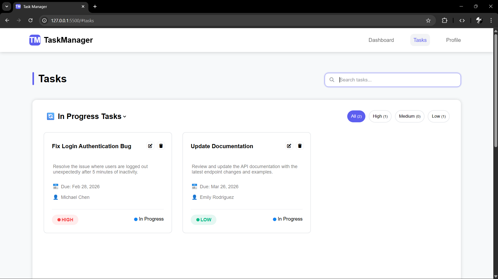
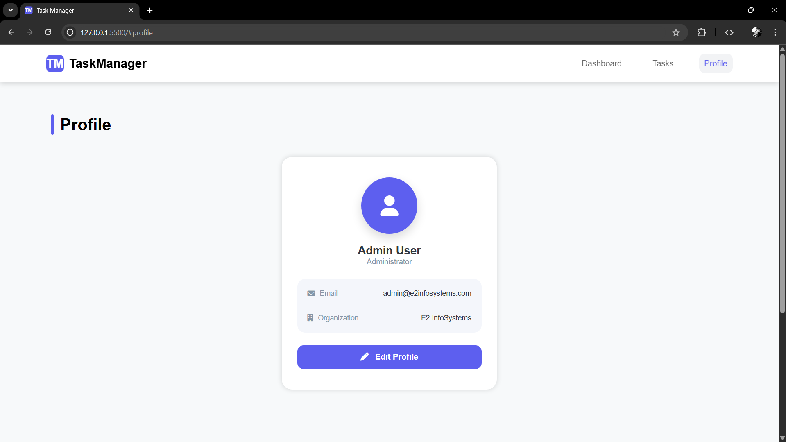
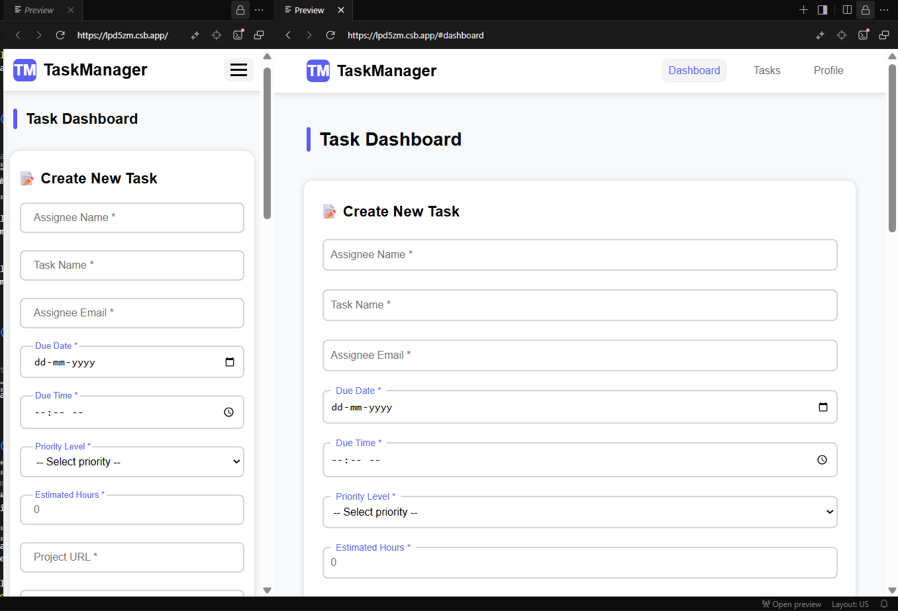
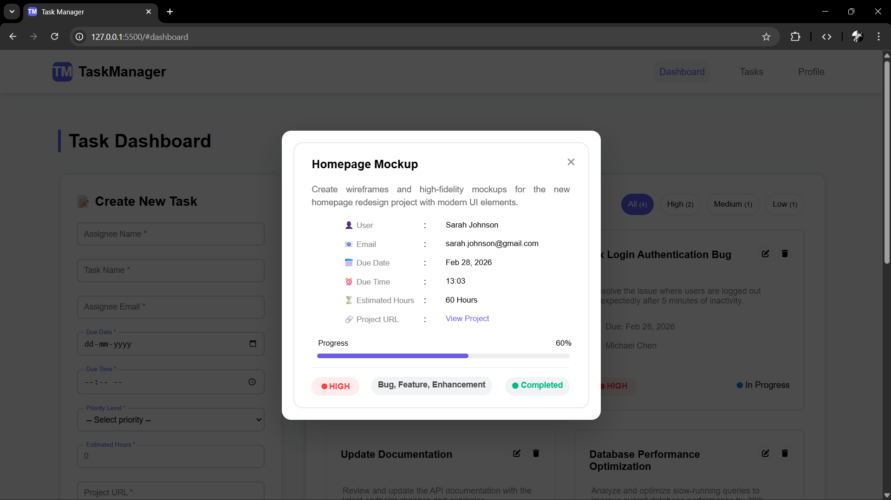
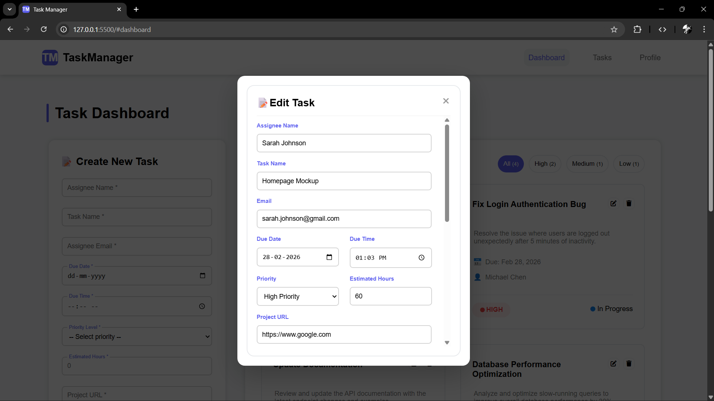
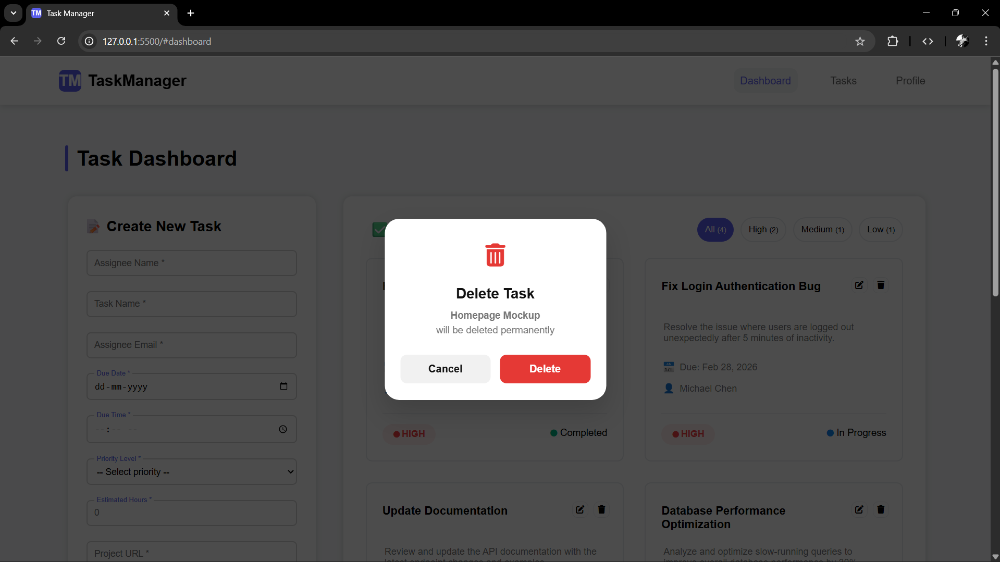

# 🗂️ Task Manager Dashboard

A **Modern Task Management Dashboard** built using **HTML5, CSS3, and JavaScript** that helps users create, manage, edit, and track tasks efficiently.  
This project demonstrates **form validation, local storage data persistence, filtering, search functionality, and responsive dashboard UI**.

The application allows users to manage tasks with priority levels, status tracking, progress updates, and detailed task views.

---

## 🚀 Features

- 📝 **Create Tasks** – Add tasks with detailed information
- ✏️ **Edit Tasks** – Update task details and progress
- 🗑️ **Delete Tasks** – Remove tasks with confirmation popup
- 📊 **Task Dashboard** – View all tasks in organized cards
- 🔎 **Search Tasks** – Quickly find tasks using keyword search
- 🎯 **Priority Filters** – Filter tasks by High, Medium, or Low priority
- 📌 **Status Filters** – Filter tasks by Pending, In Progress, or Completed
- 📂 **Task Detail Popup** – View full task information in a modal
- 📈 **Task Progress Tracking** – Update and visualize task progress
- 🔔 **Toast Notifications** – Success messages for actions
- 💾 **Local Storage Support** – Tasks are saved in the browser
- 📱 **Fully Responsive Design** – Works on laptop, tablet, and mobile

---

## 🧰 Technologies Used

- **HTML5** – Page structure and semantic layout  
- **CSS3** – Styling, animations, and responsive design  
- **JavaScript (ES6)** – Dynamic functionality and DOM manipulation  
- **LocalStorage API** – Storing tasks locally in the browser  
- **Font Awesome** – Icons used in UI components  

---

## 🌐 Live Demo

👉 https://task-manager-task-one.vercel.app/

---

## 📸 Preview











---

## ⚙️ Key Functionalities

### 📝 Task Creation
Users can create a task by filling out a form that includes:

- Assignee Name
- Task Name
- Assignee Email
- Due Date & Time
- Priority Level
- Estimated Hours
- Project URL
- Task Description
- Task Type (Bug, Feature, Enhancement)
- Task Status

The form includes **complete validation for all inputs**.

---

### 📊 Task Dashboard

Tasks are displayed in **interactive cards** showing:

- Task Title
- Description
- Due Date
- Assigned User
- Priority Level
- Status

Users can **click a task card to view full details**.

---

### ✏️ Edit Task

Tasks can be updated with:

- Updated task details
- Progress percentage
- Status updates
- Priority changes

---

### 🗑️ Delete Task

Tasks can be deleted with a **confirmation popup** to prevent accidental deletion.

---

### 🔎 Search & Filtering

The dashboard includes advanced filtering:

**Search Filter**
- Search tasks by title
- Search tasks by description
- Search tasks by assignee name

**Priority Filter**
- High Priority
- Medium Priority
- Low Priority

**Status Filter**
- Pending
- In Progress
- Completed

---

## 💾 Data Persistence

All tasks are stored in **Local Storage**, so tasks remain saved even after refreshing the page.

Example structure stored in LocalStorage:

```json
{
  "id": 17123456789,
  "username": "John Doe",
  "name": "Fix Login Bug",
  "email": "john@email.com",
  "date": "2026-03-10",
  "time": "14:30",
  "priority": "High",
  "hours": "4",
  "url": "https://project-link.com",
  "description": "Fix authentication issue",
  "progress": "60",
  "taskTypes": ["Bug"],
  "status": "In Progress"
}
```

## 📱 Responsive Design

The dashboard is fully responsive and optimized for:

- 💻 Laptop screens
- 📱 Tablets
- 📲 Mobile devices
- 📏 Small mobile screens

Media queries ensure the layout adapts smoothly across all devices.

---

## 🎯 Learning Highlights

This project helped practice:

- JavaScript DOM manipulation
- Form validation techniques
- Local Storage data management
- Dynamic UI rendering
- Advanced filtering logic
- Popup modal systems
- Responsive dashboard layout
- User experience improvements

---

## 👨‍💻 Author

**Gowtham Sundaram**

Aspiring **Fullstack Developer** passionate about building interactive web applications and modern UI dashboards.

---
